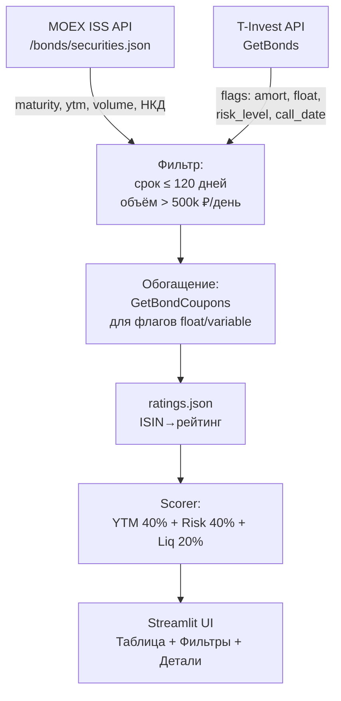

# Bond Monitor — краткосрочные облигации РФ

## Инвестиционная экспертиза (читай перед реализацией)

### Честное предупреждение о 20%+
При ставке **14,50%** (с 27.04.2026, ЦБ ожидает 14–14,5% до конца 2026) безрисковая доходность — это ~15% (краткосрочные ОФЗ). Получить **20%+ нетто** без существенного риска невозможно:
- Спред 5,5% к КС = 2–3-й эшелон, риск дефолта реален
- После НДФЛ 13% доходность 20% "грязными" → ~17,4% "чистыми"
- Реалистичная цель: **16–18% чистыми** при умеренном риске (1–2 эшелон) или **19–22% чистыми** при ВДО с осознанным риском

### Подводные камни — обязательно учесть при скрининге
- **Амортизация** (`amortization_flag`): эмитент возвращает часть номинала периодически → "купонная доходность" завышена, YTM ниже. MOEX считает YTM с учётом амортизации правильно, но проверять нужно.
- **Тип купона**: FIXED (лучший для коротких) / FLOATING (привязан к КС или RUONIA — нестабилен при снижении ставки) / VARIABLE (купон объявляется за 1–2 периода — следующий неизвестен — риск переоценки)
- **Пут-оферта**: право продать облигацию эмитенту по номиналу в конкретную дату. Может быть "ближайшим сроком" вместо даты погашения. Эффективный срок = `min(maturity_date, put_offer_date)`
- **Колл-оферта** (`call_date`): право эмитента досрочно выкупить → у вас нет гарантии получить купоны до погашения
- **НДФЛ 13%**: купоны и прирост цены облагаются. Нужно показывать YTM как после налогов: `ytm_net = ytm * 0.87`
- **НКД** (накопленный купонный доход): вы платите его при покупке — реальная цена выше рыночной. MOEX отдаёт в поле `ACCRUEDINT`
- **Ликвидность**: YTM на неликвидной бумаге рассчитан по старой цене — цифра бессмысленна. Обязателен фильтр по объёму торгов
- **Субординированные облигации** (`subordinated_flag`): при банкротстве выплачиваются последними — скрытый риск
- **Квалифицированный инвестор** (`for_qual_investor_flag`): недоступны без статуса

### Альтернативы на 0–6 месяцев
- **ОФЗ-флоатеры (серии 24ХХХ, 29ХХХ)**: привязаны к RUONIA ≈ КС − 0,1%, AAA-рейтинг, нет риска дефолта. Доходность ~14,3–14,5%
- **Фонды денежного рынка (LQDT, SBMM, TMON)**: ~КС − 0,2%, высокая ликвидность, налог только при продаже. Проще и надёжнее, но до 15%
- **Корпоративные флоатеры 1 эшелона** (Газпром, Норникель, Роснефть): КС+1,5–2,5% → 16–17%, приемлемый риск
- **ВДО 3 эшелона**: 20–28%, но статистика дефолтов в 2024–2025 показала несколько случаев в год — только малую долю портфеля

---

## Источники данных

### MOEX ISS API (бесплатно, задержка 15 мин)
- Список всех торгуемых облигаций: `https://iss.moex.com/iss/engines/stock/markets/bonds/securities.json`
- Поля из блока `securities`: `SECID`, `SHORTNAME`, `MATDATE`, `OFFERDATE`, `COUPONPERCENT`, `ACCRUEDINT`, `FACEVALUE`, `LOTVALUE`
- Поля из блока `marketdata`: `LAST`, `YIELDATWAP` (YTM), `VOLUME`, `DURATION`
- Один запрос возвращает до 100 бумаг, нужна пагинация (`start=0, 100, 200...`)

### T-Invest API (gRPC, нужен токен)
- `GetBonds(InstrumentsRequest)` → список всех облигаций с полями:
  - `maturity_date`, `floating_coupon_flag`, `amortization_flag`, `perpetual_flag`
  - `call_date`, `subordinated_flag`, `risk_level` (1=LOW, 2=MODERATE, 3=HIGH)
  - `for_qual_investor_flag`, `liquidity_flag`
- `GetBondCoupons(figi, from_, to_)` → тип купона (`COUPON_TYPE_FIXED`, `COUPON_TYPE_FLOATING`, `COUPON_TYPE_VARIABLE`)
- Библиотека: `tinkoff-investments` (pip)

### Кредитные рейтинги
- **Эксперт РА**: `https://raexpert.ru/ratings/credits/current/` — открытые данные
- **АКРА**: `https://www.acra-ratings.ru/ratings/issuers/` — открытые данные
- Первая версия монитора: статический JSON с маппингом ISIN → рейтинг (обновлять вручную раз в неделю)
- Вторая версия: парсинг через MOEX ЦКИ API `/iss/cci/info-nsd/securitybooks/bonds/securities` (рейтинги там есть)

---

## Архитектура

```
bond_monitor/
├── .env                    # TINKOFF_TOKEN=...
├── requirements.txt
├── app.py                  # Streamlit точка входа
├── data/
│   ├── moex_client.py      # MOEX ISS API
│   ├── tinvest_client.py   # T-Invest gRPC
│   └── ratings.json        # статический кэш рейтингов ISIN→rating
├── core/
│   ├── bond_model.py       # dataclass BondRecord
│   └── scorer.py           # скоринговая модель
└── ui/
    └── components.py       # переиспользуемые Streamlit-компоненты
```

---

## Скоринговая модель (0–100 баллов)

```
Score = YTM_score * 0.40 + Risk_score * 0.40 + Liquidity_score * 0.20
```

- **YTM_score** (0–100): `(ytm_net - KEY_RATE * 0.87) / max_spread * 100`
  - YTM нет смысла считать если он ≤ КС × 0,87 (ниже безрисковой после налогов)
- **Risk_score** (0–100): базируется на `risk_level` от T-Invest + штрафы:
  - risk_level=1 → 80, risk_level=2 → 55, risk_level=3 → 25
  - `amortization_flag=True` → −5 (сложнее рассчитать реальный YTM)
  - `floating_coupon_flag=True` → −10 (неизвестны будущие купоны)
  - `subordinated_flag=True` → −30 (критический риск)
  - рейтинг из `ratings.json`: AAA→+20, AA→+10, A→0, BBB→-10, ниже→-25
- **Liquidity_score** (0–100): `log10(volume_rub) / log10(max_volume) * 100`

---

## Поток данных



---

## Streamlit UI

Три вкладки:

1. **Скринер** — таблица с сортировкой по Score, фильтры: эшелон, тип купона, срок, мин. YTM. Цветовая индикация риска.
2. **Детали бумаги** — при клике: купонный график, ближайшие выплаты, НКД, YTM с/без НДФЛ, предупреждения по флагам
3. **Портфельный калькулятор** — ввести сумму, получить расчёт: сколько купить, когда придут деньги, итоговая доходность с НКД и НДФЛ

Кнопка "Обновить" — перезагружает данные с MOEX (кэш 15 мин через `st.cache_data(ttl=900)`).

---

## Этапы реализации

1. Базовый MOEX-клиент + фильтрация по сроку/ликвидности
2. T-Invest клиент + обогащение флагами
3. Скоринговая модель + статический рейтинговый кэш
4. Streamlit UI: скринер и таблица
5. Детальная карточка бумаги + купонный график
6. Портфельный калькулятор с расчётом НДФЛ и НКД
