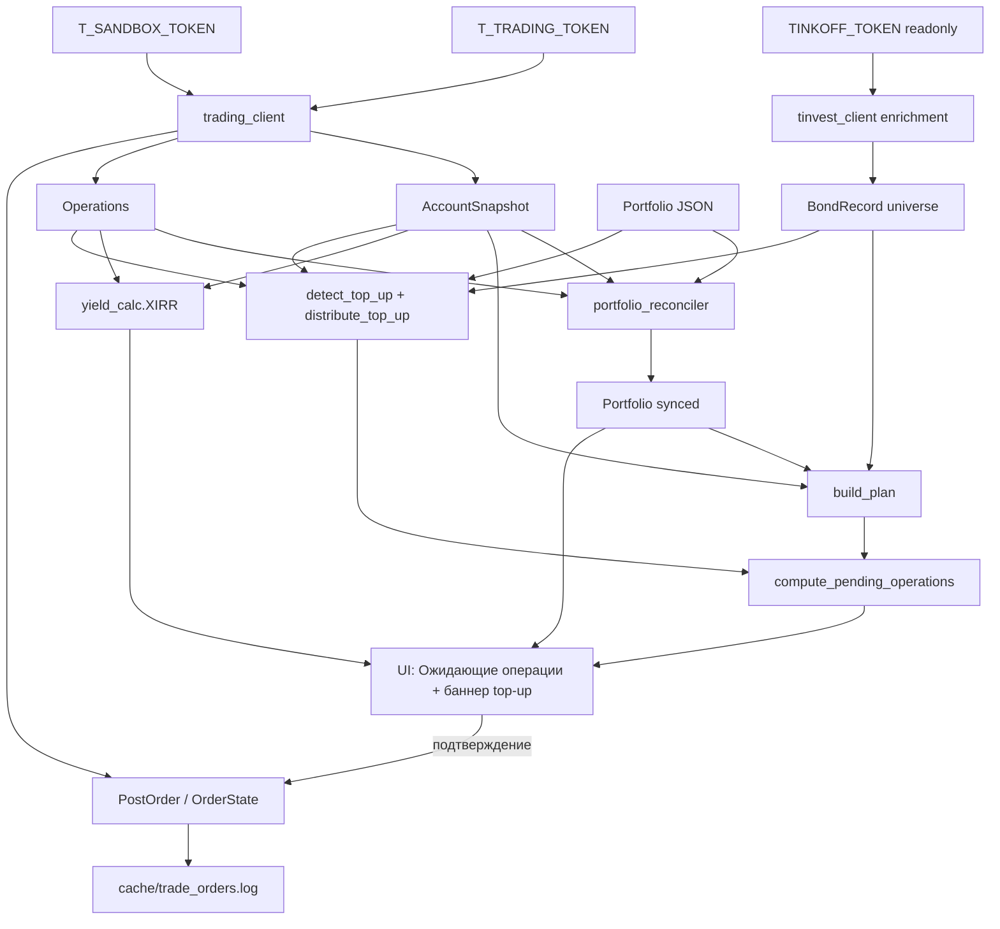

## Концепция режима торговли

Портфель получает атрибут `mode`: `SIMULATION` (текущее поведение) или `TRADING`. В режиме `TRADING`:
- состав «заморожен» — нельзя автосоставить заново, удалить позицию, изменить `initial_amount_rub` / `horizon_date` / `risk_profile`;
- позиции и кэш сверяются с реальным счётом T-Invest (`account_id`);
- покупки/продажи делаются заявками LIMIT с явным подтверждением пользователем цены;
- пут-оферту нельзя подать через API → она превращается в TODO с шаблоном для чата брокера;
- доходность считается XIRR-ом по операциям именно этого портфеля с даты `trading_started_at`;
- свободный кэш, начисленный пользователем на счёт вручную (top-up), обнаруживается через `OPERATION_TYPE_INPUT` и по явной кнопке распределяется по стратегии (топ скоринга для профиля).

Переход однонаправленный по умолчанию, но «отвязать счёт» можно через модалку с явным предупреждением.

## Ключевые архитектурные решения (по уточнениям)

- **Sandbox + production**: поддерживаем оба, на портфель привязывается `account_kind` (`sandbox` / `production`); токены раздельные (`T_TRADING_TOKEN_PRODUCTION`, `T_TRADING_TOKEN_SANDBOX`).
- **Привязка**: один счёт = один торговый портфель. На старте перехода счёт должен быть либо пуст (по облигациям), либо все его бумаги импортируются в портфель — если есть «чужие» инструменты (акции, валюта сверх кэша), переход **блокируется** с понятным сообщением.
- **Стартовый бюджет**: при переходе показываем кэш на счёте и `initial_amount_rub` портфеля, даём выбрать (или ввести своё). Зафиксированное значение становится «cost basis» для XIRR.
- **Цена покупки импортируемых позиций**: средневзвешенная из истории `GetOperationsByCursor` (BUY-операции по figi), `purchase_date` = самая ранняя BUY-сделка.
- **Тип ордеров по умолчанию**: `LIMIT` с предзаполненной ценой `last_price × (1 + buffer)` для BUY и `× (1 − buffer)` для SELL; пользователь подтверждает цену в UI перед PostOrder.
- **Пут-оферты**: **API не умеет подавать оферту**. В торговом режиме пут-оферта = TODO с готовым текстом для чата брокера + ссылка на приложение, никаких автоматических SELL.
- **Реинвестиции**: будущие слоты остаются «прогнозом» (можно менять `confirmed_isin`), но в момент `trigger_date ≤ today` слот превращается в `PendingOperation` «купить замену».
- **Top-up свободного кэша**: detection — гибрид (точный источник — `OPERATION_TYPE_INPUT` после `last_top_up_processed_at`; фактический `account_snapshot.money_rub` — верхний лимит распределения). Trigger — явная кнопка «Распределить» в UI (не автоматически). Алгоритм — выбор лучших по скорингу для профиля, без различения «новые/существующие»: уже купленные бумаги получают дополнительные лоты в рамках общего лимита `MAX_POSITION_SHARE` от нового бюджета, новые добавляются если позиций мало или скоринг лучше.
- **Возврат в симуляцию**: только с подтверждением модалкой; реальный счёт после отвязки не трогается, локальные позиции переходят в обычный симуляционный режим.

## Что нельзя через публичное API (фиксируем явно)

- Подача заявки на пут-оферту (corporate action, не биржевая заявка) — только через чат брокера руками.
- Открытие нового счёта.
- Заявки на сумму > 30 млн ₽ (требует SMS-подтверждения вне API).
- Торговля read-only токеном (нужен full-access; sandbox-токен работает только на sandbox endpoint).

## Расширение модели (миграция cache/portfolios.json)

Файл [core/portfolio_model.py](core/portfolio_model.py):

- Новый enum `PortfolioMode = SIMULATION | TRADING`.
- Новый enum `AccountKind = SANDBOX | PRODUCTION`.
- `Portfolio` получает:
  - `mode: PortfolioMode = SIMULATION`
  - `account_id: str | None = None`
  - `account_kind: AccountKind | None = None`
  - `account_label: str | None = None` (кэш имени счёта для UI)
  - `trading_started_at: date | None = None`
  - `last_synced_at: str | None = None` (ISO-таймстамп последней успешной сверки)
  - `last_top_up_processed_at: str | None = None` (ISO-таймстамп — после этой даты INPUT-операции считаются «новым top-up», ещё не предложенным к распределению)
  - `acknowledged_top_ups_rub: float = 0.0` (накопленная сумма всех top-up, уже распределённых пользователем — для текущего «total budget» при ребалансировке)
- `PortfolioPosition` получает:
  - `figi: str | None = None` (резолвится при импорте/покупке)
  - `actual_lots: int | None = None` (фактическое количество лотов на счёте; в симуляции равно `lots`, в торговом — фактический остаток с брокера; расхождение → warning)
- Новый dataclass `PendingOperation`:
  - `id: str` (uuid)
  - `kind: Literal["initial_buy", "reinvest_buy", "top_up_buy", "put_offer_submit", "manual_sell"]`
  - `isin: str`, `figi: str | None`, `name: str`
  - `lots: int`, `suggested_price_pct: float`
  - `due_date: date | None`, `reason: str` (для UI)
  - `slot_id: str | None` (для маппинга на `ReinvestmentSlot`)
  - `top_up_batch_id: str | None` (для группировки операций одной «волны» top-up распределения — позволяет показать их вместе в UI и при отмене всех откатить `last_top_up_processed_at`)
- Новый dataclass `TradeRecord` (минимальный, аудит только последних статусов submit'нутых заявок; полная история — через `GetOperations`):
  - `request_uid: str`, `order_id: str | None`, `account_id: str`
  - `figi: str`, `direction`, `lots`, `price_pct: float | None`
  - `submitted_at: str`, `status: str`, `last_state_checked_at: str | None`

В `Portfolio` добавляем `pending_operations: list[PendingOperation]` и `trade_records: list[TradeRecord]`.

JSON-миграция: `from_dict` старых портфелей по умолчанию проставляет `mode = SIMULATION`, `account_id = None`, пустые списки — никаких breaking changes.

## Новый слой data: торговля и сверка

### [data/trading_client.py](data/trading_client.py) — переписать целиком

Текущий файл сейчас содержит только `TradeOrder` + `submit_order` бросающий `NotImplementedError`. Заменяем на полноценный фасад над `t_tech.invest`.

Ключевые функции (все принимают `token: str`, `account_kind: AccountKind`):
- `list_accounts(token, account_kind) -> list[AccountInfo]` — `users.get_accounts` с фильтром `OPEN` + `access_level == FULL_ACCESS`.
- `get_account_snapshot(token, account_kind, account_id) -> AccountSnapshot` — объединённый `get_portfolio` + `get_positions` + `get_margin_attributes`; возвращает свободный кэш RUB, позиции (figi, balance, blocked), expected_yield.
- `get_account_operations(token, account_kind, account_id, *, from_date) -> list[OperationRecord]` — `operations.get_operations_by_cursor` с фильтром по дате, типам (BUY/SELL/COUPON/BOND_REPAYMENT*/TAX/BROKER_FEE/INPUT/OUTPUT).
- `post_limit_order(token, account_kind, *, account_id, figi, direction, lots, price_pct, request_uid) -> PostOrderResult` — `orders.post_order` с `LIMIT`, идемпотентность через `request_uid`.
- `get_order_state(token, account_kind, account_id, order_id) -> OrderState` — `orders.get_order_state`.
- `cancel_order(token, account_kind, account_id, order_id) -> bool`.
- `preview_order_price(token, account_kind, *, account_id, figi, direction, lots, price_pct) -> OrderPricePreview` — `orders.get_order_price` (комиссии, НКД, итог).

В файл также добавим:
- Маппинг цены: облигации торгуются в % от номинала; конвертация `price_pct → Quotation` через `decimal_to_quotation`.
- Защиту от сумм > 30 млн ₽ перед `post_order` (raise `OrderTooLargeError`).
- Запись audit-лога в `cache/trade_orders.log` (JSONL append, файл `.gitignore`).

### [data/tinvest_client.py](data/tinvest_client.py) — расширение

Текущая роль (read-only enrichment универса) не меняется. Добавляем хелперы для **торгового** инструмента:
- `resolve_figi_for_isin(token, isin) -> str | None` — через `find_instrument` либо bulk-кэш универса.
- `check_trade_available(token, figi) -> TradeAvailability` — флаги `api_trade_available_flag`, `buy_available_flag`, `sell_available_flag` из `bond_by(figi)`.

### [core/portfolio_reconciler.py](core/portfolio_reconciler.py) — новый модуль

Чистые функции, отдельно от Streamlit:
- `validate_account_for_attach(account_snapshot, portfolio, universe) -> AttachValidation` — проверяет, что на счёте нет «чужих» инструментов (всё, кроме облигаций + RUB-кэш = блокер). Возвращает `{can_attach: bool, blockers: list[str], existing_bond_positions: list[ImportablePosition]}`.
- `build_positions_from_account(account_snapshot, operations, universe) -> list[PortfolioPosition]` — формирует позиции по сделкам BUY (средневзвешенная цена, ранняя дата покупки) для импорта при переходе в режим торговли.
- `reconcile_positions(portfolio, account_snapshot, operations) -> ReconciliationResult` — сравнивает `portfolio.positions` с фактом, обновляет `actual_lots`, `cash_balance_rub`, выявляет дрейф (фактических лотов больше/меньше ожидаемого). Возвращает список расхождений для UI-предупреждений.

### [core/yield_calc.py](core/yield_calc.py) — новый модуль

- `calculate_portfolio_xirr(operations, *, isins, current_value_rub, as_of) -> float | None` — XIRR по cashflow только по бумагам портфеля + текущая оценка позиций. Зависимость: `pyxirr` (`requirements.txt`).
- `summarize_actual_performance(portfolio, account_snapshot, operations) -> ActualPerformance` — XIRR + сумма купонов + реализованная прибыль + неупущенный capital gain.

### [core/pending_operations.py](core/pending_operations.py) — новый модуль

- `compute_pending_operations(portfolio, plan, account_snapshot, today) -> list[PendingOperation]` — на основе:
  - незавершённых INITIAL-покупок (если в режиме торговли портфель не докуплен до `positions`);
  - слотов с `trigger_date ≤ today` без подтверждённой покупки;
  - пут-оферт с `PENDING`, у которых открыто окно подачи.
- Идемпотентность: pending operation помечена «выполненной», когда соответствующая `TradeRecord` имеет `EXECUTION_REPORT_STATUS_FILL` или фактический баланс счёта это подтверждает.

## Изменения планировщика

[core/portfolio_planner.py](core/portfolio_planner.py):

- `build_plan(portfolio, universe, *, today, key_rate, tax_rate, account_snapshot=None)` — новый опциональный аргумент. В режиме торговли:
  - стартовая отметка кэша берётся из `account_snapshot.money_rub`, а не из `portfolio.cash_balance_rub`;
  - в `purchase`-события вписываются только реально не купленные бумаги (которые ещё в pending);
  - `_position_end_date` для пут-оферты в режиме торговли **всегда** возвращает `maturity_date`, если решение `PENDING` (для оценки худшего сценария), и `offer_date` только при `EXERCISE` с подтверждённой подачей (см. ниже).
- В режиме торговли в симуляции пут-оферта моделируется как «лучший сценарий» (как ты и просил):
  - флаг `PortfolioPlan.assume_best_put_outcome` для симуляции (если режим = SIMULATION): функция выбирает между EXERCISE/HOLD то, что выгоднее, и сохраняет это решение в `PortfolioPlan` (не персистит в Portfolio).
  - в режиме TRADING решение `PutOfferDecision` остаётся явным выбором пользователя.

В UI это даст: в режиме симуляции пользователь видит «оптимистичную» прогнозную доходность без необходимости щёлкать EXERCISE/HOLD по каждой бумаге, в режиме торговли — реалистичный план на основе фактических решений.

## Top-up свободного кэша

Сценарий: пользователь вручную пополнил брокерский счёт (например, начислил зарплату на ИИС). На счёте появился «лишний» кэш сверх запланированного — мы хотим распределить его в соответствии с торговой стратегией.

### Detection (гибрид)

Новая функция в [core/portfolio_reconciler.py](core/portfolio_reconciler.py):

```python
def detect_top_up(
    portfolio: Portfolio,
    operations: list[OperationRecord],
    account_snapshot: AccountSnapshot,
) -> TopUpDetection:
    """
    Возвращает информацию о свободном кэше, готовом к распределению.

    Источник: OPERATION_TYPE_INPUT после portfolio.last_top_up_processed_at
    (если None — после portfolio.trading_started_at).

    Верхний лимит распределения: account_snapshot.money_rub (минус резерв
    под комиссии — например, 0.5%).
    """
```

`TopUpDetection` содержит:
- `pending_top_up_rub: float` — сумма «свежих» INPUT-операций;
- `available_for_distribution_rub: float` — `min(pending_top_up_rub, account_snapshot.money_rub × (1 − cost_buffer))`;
- `input_operations: list[OperationRecord]` — список операций (для аудита в UI).

Логика «отсечения уже обработанных»:
- При генерации `top_up_buy` PendingOperations и подтверждении пользователем — обновляем `Portfolio.last_top_up_processed_at = now()`, в `acknowledged_top_ups_rub` плюсуем сумму распределения.
- Если пользователь отменил **все** pending одной партии (`top_up_batch_id`) — откатываем `last_top_up_processed_at` обратно (rollback по сохранённому в batch значению), чтобы баннер снова показал тот же top-up.

### Алгоритм распределения

Новая функция в [core/portfolio_planner.py](core/portfolio_planner.py):

```python
def distribute_top_up(
    *,
    portfolio: Portfolio,
    universe: list[BondRecord],
    top_up_amount_rub: float,
    today: date,
    key_rate: float,
    tax_rate: float,
) -> tuple[list[TopUpAllocation], list[str]]:
    """
    Распределяет top_up_amount_rub по облигациям из universe в соответствии
    с риск-профилем портфеля.

    Алгоритм (по уточнению пользователя — топ скоринга, без различения
    «новых» и «существующих»):

    1. Фильтр universe через risk_profile_filter(portfolio.risk_profile)
       + put_offer_buy_blocked(today).
    2. Сортировка по score_bonds_for_profile(profile).
    3. Считаем новый общий бюджет:
       total_budget = portfolio.initial_amount_rub
                    + portfolio.acknowledged_top_ups_rub
                    + top_up_amount_rub
    4. Для каждой бумаги из топа (пока top_up не распределён):
       a. Текущая стоимость этой бумаги в портфеле (если уже есть):
          current_value_rub = (sum of lots × dirty_price) для совпадающего ISIN.
       b. Максимально допустимая стоимость:
          cap = total_budget × MAX_POSITION_SHARE (0.30)
       c. Доступная «дыра»: gap = max(cap − current_value_rub, 0).
       d. Покупаем round(min(target_share × total_budget, gap, top_up_remaining)
                       / lot_dirty_cost) лотов; если 0 лотов — переходим к следующей.
       e. Уменьшаем top_up_remaining на фактическую стоимость.
    5. Останавливаемся, когда top_up_remaining < min(lot_cost) или достигнут
       MAX_AUTO_POSITIONS (с учётом существующих + новых).
    """
```

`TopUpAllocation`:
- `isin`, `figi`, `name`, `lots`, `suggested_price_pct` (текущая dirty + buffer);
- `is_existing_position: bool` — для UI (бейдж «уже в портфеле»);
- `estimated_amount_rub: float`.

### UI: баннер + мастер распределения

В [ui/portfolio.py](ui/portfolio.py), в торговом режиме после карточки фактической доходности:

1. **Баннер обнаружения** (`st.info` или `st.warning`):
   - Показывается, если `detection.pending_top_up_rub > 0` и нет активных pending с `kind=top_up_buy` для текущей партии.
   - Текст: «На счёте обнаружено свободных средств: **X ₽** (пополнения с DD.MM.YYYY). Распределить в соответствии со стратегией?».
   - Кнопка `Распределить` → открывает экспандер с предпросмотром.

2. **Предпросмотр распределения** (раскрывающийся блок):
   - Таблица аллокаций: ISIN, название, лоты, цена, сумма, бейдж «новая» / «уже в портфеле».
   - Итого: «Будет потрачено Y ₽ из X ₽ доступных. Остаток N ₽».
   - Кнопки `Подтвердить и создать заявки` / `Отмена`.

3. **Подтверждение** → создаём `PendingOperation kind=top_up_buy` с общим `top_up_batch_id`, обновляем `last_top_up_processed_at`. Пользователь дальше подтверждает каждую покупку как обычные initial_buy в блоке «Ожидающие операции».

### Что НЕ делаем (явно)

- **Не продаём** существующие позиции для ребалансировки — top-up = строго добавление.
- **Не нарушаем** `MAX_POSITION_SHARE` — даже для уже существующих позиций; если все топ-бумаги уже на потолке, доступна только новая бумага из топа.
- **Не учитываем** автоматически списания, выводы (`OPERATION_TYPE_OUTPUT`) — для корректировки cost basis при выводе нужен будет отдельный механизм (вне scope этого плана; зафиксировано в notes).

## Изменения UI

[ui/portfolio.py](ui/portfolio.py) — большой рефакторинг, но с сохранением структуры:

### Карточка «Режим» в начале вкладки

- Бейдж `Симуляция` / `Торговля (sandbox)` / `Торговля (production)`.
- Кнопка «Перевести в режим торговли» (если SIMULATION) → запускает мастер перехода.
- Кнопка «Отвязать счёт» (если TRADING) → модалка с подтверждением.
- Метка `last_synced_at`, кнопка «Синхронизировать со счётом» (вызов reconciler + replan, кэшируем 5 минут).

### Мастер перехода в режим торговли (модалка)

Шаги:
1. Выбор контура (`sandbox` / `production`).
2. `list_accounts` → селектор счетов с `FULL_ACCESS`.
3. `get_account_snapshot` + `validate_account_for_attach`:
   - если есть «чужие» инструменты → красный блокер с инструкцией («продайте/выведите N бумаг»), кнопка disabled;
   - если на счёте есть облигации → предложение импортировать (галки по каждой);
4. Выбор стартового бюджета: показываем `account_snapshot.money_rub`, `portfolio.initial_amount_rub`, поле ввода (default = меньшее из двух).
5. Подтверждение → `Portfolio.mode = TRADING`, `account_id`/`account_kind` зафиксированы, `trading_started_at = today`, импортированные позиции добавлены в `portfolio.positions`.

### Блок «Ожидающие операции» (новая секция)

Список карточек `PendingOperation`:
- `initial_buy` / `reinvest_buy` / `top_up_buy`: название, лоты, текущая `last_price`, поле `Лимитная цена` (`last_price + buffer`), кнопки `Купить` / `Пропустить`. Для `top_up_buy` — дополнительная плашка с `top_up_batch_id` (группировка одной волны) и кнопка «Отменить всю партию top-up» (откатывает `last_top_up_processed_at`, чтобы баннер появился снова).
- `put_offer_submit`: текст «Подайте заявку на пут-оферту до DD.MM», шаблон сообщения (text_area readonly), кнопка `Скопировать`, ссылка на T-Invest. Кнопка «Отметить как поданное» переводит `PutOfferDecision = EXERCISE` (с возможностью отмены позже, если окно ещё открыто).
- `manual_sell`: на случай решения пользователя.

Подтверждение покупки → `post_limit_order` → запись `TradeRecord` → polling статуса (3–5 опросов по 2 с) → обновление UI.

### Таблица позиций в режиме торговли

- Колонка `actual_lots` появляется отдельно, если ≠ `lots` (красный индикатор расхождения).
- Колонка «✕» (удалить) **скрывается** или заменяется на «Поставить SELL» (создаёт `PendingOperation kind=manual_sell`).
- Кнопка «Очистить состав» / «Автосостав» — disabled с tooltip-объяснением.

### Карточка фактической доходности

- XIRR (вычисленный из операций по портфельным ISIN с `trading_started_at`).
- Купоны полученные, налог удержанный (сумма из операций).
- Дельта vs прогноз: `(actual_xirr − plan_yield_to_horizon) × 100`.
- Сноска: данные на `last_synced_at`.

### Селектор облигации в слотах (replacement)

В режиме `TRADING` для слотов с `trigger_date > today` остаётся возможность менять `confirmed_isin`, как сейчас. Для слотов с `trigger_date ≤ today` UI блокирует изменения (это уже TODO).

## Изменения app.py

[app.py](app.py):

- В `.env` поддерживаются переменные:
  - `T_TRADING_TOKEN_PRODUCTION` — full-access токен для прода;
  - `T_TRADING_TOKEN_SANDBOX` — sandbox-токен;
  - `TINKOFF_TOKEN` остаётся read-only для enrichment универса (как сейчас).
- В сайдбаре селектор контура для глобальной видимости «какой токен сейчас доступен» (не для портфеля — у каждого свой `account_kind`).
- Новые query-params для подтверждения pending operations:
  - `?pending_confirm=<id>&portfolio_id=<id>` — отправка заявки;
  - `?pending_cancel=<id>&portfolio_id=<id>` — отмена pending;
  - `?order_cancel=<order_id>&portfolio_id=<id>` — отмена активной заявки в брокере;
  - `?top_up_batch_cancel=<batch_id>&portfolio_id=<id>` — отмена всей партии top-up распределения (откат `last_top_up_processed_at`).
  Обрабатываются до рендера вкладок, по аналогии с существующим `?pos_remove`.

## Зависимости

[requirements.txt](requirements.txt):
- `t-tech-investments` (уже есть как tarball; задокументировать актуальную версию);
- добавить `pyxirr>=0.10` для XIRR (нативная C-имплементация, быстрее scipy);
- никаких новых тяжёлых либ для торговли — всё через `t_tech.invest`.

## Кэширование и производительность

- `st.cache_data(ttl=300, show_spinner=...)` для `get_account_snapshot` и `get_account_operations` (как у MOEX-клиента).
- Кэш ключуется `(token_hash, account_id, account_kind)`.
- Кнопка «Синхронизировать» сбрасывает кэш через `cache_data.clear()` для этого ключа.
- `polling` статусов заявок — короткий (3–5 опросов) внутри handler'а; долгие — через rerun по таймеру (`st.empty()` + `time.sleep` неприемлемо в Streamlit; используем явный кнопочный «Обновить статус заявок»).

## Безопасность и аудит

- `cache/trade_orders.log` — JSONL append-only лог всех отправок и отмен (timestamp, account_id, request_uid, order_id, params, ответ). Добавить в `.gitignore`.
- Перед PostOrder двойная сверка ISIN → FIGI (по `BondRecord.figi` + повторный `bond_by(figi)` для подстраховки).
- Проверка `check_trade_available(figi).api_trade_available_flag` перед каждой заявкой.
- Минимальные права: можно работать read-only токеном для блокирующего view (выбор счёта, импорт позиций), но при попытке отправить заявку выводим понятный error и блокируем кнопку.

## Тестирование

- Юнит-тесты для чистых функций (`portfolio_reconciler`, `pending_operations`, `yield_calc`) на синтетических dataclass-ах — по аналогии с тем, что уже описано в [AGENTS.md](AGENTS.md).
- Sandbox-сценарий «end-to-end»: `OpenSandboxAccount` → `SandboxPayIn` → переход в режим торговли → BUY одной бумаги → reconcile → XIRR через купон-симуляцию sandbox-а.

## Актуализация [AGENTS.md](AGENTS.md)

В существующий раздел «Портфели» добавить подраздел **«Режим торговли»** со следующим содержимым:
- Концепция (симуляция vs торговля).
- Маппинг полей `Portfolio.mode`, `account_id`, `account_kind`, `trading_started_at`.
- Файлы новых слоёв (`trading_client`, `portfolio_reconciler`, `pending_operations`, `yield_calc`).
- Жёсткое ограничение по пут-оферте (нельзя через API), как реализовано (TODO + шаблон чата).
- Sandbox vs production: переменные окружения и endpoints.
- XIRR-методика (по операциям ISIN'ов портфеля, с `trading_started_at`).
- Безопасность: audit log, idempotency, лимит 30 млн ₽.
- Top-up свободного кэша: detection (гибрид INPUT-операций + money_rub), алгоритм `distribute_top_up`, поля `last_top_up_processed_at`/`acknowledged_top_ups_rub`, UI-кнопка «Распределить» с предпросмотром, ограничения (не продаём, не нарушаем MAX_POSITION_SHARE).
- Где НЕ работает текущая модельная логика и почему (cash_balance, purchase_date, автосостав отключён).

Также:
- В разделе «Расширение: API торговли» переписать с актуальным `t_tech.invest` namespace (сейчас всё ещё `tinkoff.invest` в тексте).
- В разделе «Переменные окружения» добавить `T_TRADING_TOKEN_PRODUCTION`, `T_TRADING_TOKEN_SANDBOX`.

## Поток данных в режиме торговли



## Этапы внедрения (последовательно)

1. Миграция модели + персистентность (`PortfolioMode`, `account_id`, миграция `from_dict`, новые dataclass-ы, поля `last_top_up_processed_at`, `acknowledged_top_ups_rub`).
2. `data/trading_client.py` — полная реализация API-фасада + sandbox; audit log.
3. `data/tinvest_client.py` — добавить `resolve_figi_for_isin`, `check_trade_available`.
4. `core/portfolio_reconciler.py` — `validate_account_for_attach`, `build_positions_from_account`, `reconcile_positions`, `detect_top_up`.
5. `core/yield_calc.py` — XIRR на pyxirr.
6. `core/portfolio_planner.py` — поддержка `account_snapshot`, опция «лучший исход пут-оферты» для симуляции, `distribute_top_up`.
7. `core/pending_operations.py` — генерация TODO (`initial_buy`, `reinvest_buy`, `top_up_buy`, `put_offer_submit`) + дедупликация по статусам `TradeRecord` и `top_up_batch_id`.
8. `ui/portfolio.py` — карточка режима, мастер перехода, блок ожидающих операций, карточка фактической доходности, баннер top-up + предпросмотр распределения, disable управления составом в режиме торговли.
9. `app.py` — новые env-переменные, новые query-params для подтверждений и отмен (включая `?top_up_batch_cancel`).
10. `AGENTS.md` — раздел «Режим торговли» (включая подсекцию «Top-up свободного кэша»); обновление namespace `t_tech.invest` в разделе «Расширение: API торговли»; новые env-переменные.

После этого имеет смысл прогнать sandbox-сценарий: создать тестовый портфель, прицепить к sandbox-счёту с виртуальными деньгами, прокликать несколько покупок и реинвестицию через симулированный купон.