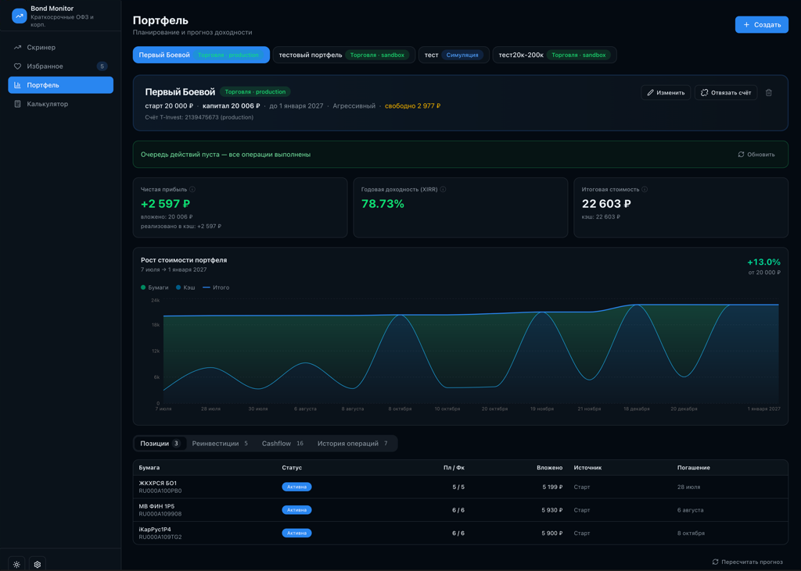

# Bond Monitor — краткосрочные облигации РФ

Bond Monitor — веб-приложение для отбора и планирования портфеля краткосрочных облигаций РФ. Данные MOEX ISS, рейтингов и T-Invest собираются в единую базу; скринер ранжирует бумаги по YTM, ликвидности и риску. Планировщик автосоставляет портфель, прогнозирует cashflow, реинвестиции и XIRR до горизонта. В TRADING mode портфель сверяется со счётом брокера; фоновый **notifier** мониторит пут-оферты и риск эмитента, шлёт Telegram и публикует события в UI. Стек: Litestar API + React SPA + Redis.


## На чём зарабатываем

- Купонный доход — основной источник, считается net после НДФЛ 13%.
- Дисконт к номиналу — покупка ниже 100% даёт доход при погашении (тоже с учётом налога на курсовую разницу).
- Реинвест — сложный процент: погашения и накопленный купонный кэш каждые ~30 дней уходят в новые лучшие бумаги (цепочка до 10 хопов).




## Возможности

- **Скринер** — таблица ликвидных бумаг со скорингом YTM/риск/ликвидность
- **Избранное** — отслеживание выбранных ISIN
- **Портфель** — автосостав, прогноз cashflow, планирование до горизонта
- **Калькулятор** — расчёт доходности с учётом НДФЛ
- **Торговля** (TRADING mode) — интеграция T-Invest API (sandbox/production)
- **Уведомления** — фоновый воркер: пут-оферта (окно подачи открыто), критичные изменения риска эмитента; Telegram + панель в UI

## Быстрый старт

### Docker (локально)

```bash
cp .env.example .env
docker compose up --build
```

Сервисы: `api`, `web`, `redis`, `notifier` (тот же образ, что у API). Notifier сканирует trading-портфели по расписанию и публикует события в Redis Stream; API читает шину и отдаёт их в UI.

- Web UI: http://localhost:3000
- API: http://localhost:8000/health

### Локальная разработка

```bash
# Backend
cp .env.example .env
uv sync --directory backend --extra dev --python 3.12
uv run --directory backend uvicorn bond_monitor.main:app --reload --port 8000

# или
task run:back

# Frontend (другой терминал)
cd frontend && npm install && npm run dev

# или
task run:front

# Notifier (нужен Redis — в Docker он поднимается compose'ом;
# локально: docker compose up -d redis)
task run:notifier
```

- Web UI: http://localhost:5173 (прокси `/api` → `:8000`)

Для Telegram-уведомлений добавьте в `.env`:

```env
TELEGRAM_BOT_TOKEN=...
TELEGRAM_NOTIFY_USER_ID=139693774
REDIS_URL=redis://localhost:6379/0
```

### Тесты

```bash
# Backend unit tests
uv run --directory backend pytest tests/unit -m "not sandbox"

# Sandbox integration (требует T_TRADING_TOKEN_SANDBOX)
T_TRADING_TOKEN_SANDBOX=t.xxx uv run --directory backend pytest tests/integration/sandbox -m sandbox

# Playwright e2e (нужен запущенный frontend + API)
cd e2e/playwright && npm install && npx playwright test
```

## Структура

```
backend/src/bond_monitor/   # Litestar API, DDD layers
  notifier/                 # фоновый воркер (python -m bond_monitor.notifier)
  domain/notifications/     # правила алертов, fingerprint, доставка
frontend/src/               # React + Tailwind + shadcn-style UI
e2e/playwright/             # Webapp e2e tests
data/ratings.json           # Vendored credit ratings (read-only)
cache/                      # MOEX cache, SQLite DB, notifier ledger
```

Подробная архитектура — в [AGENTS.md](AGENTS.md).

## Notification worker

Фоновый процесс `notifier` периодически (по умолчанию раз в час) сканирует trading-портфели:

| Событие | Условие |
|---------|---------|
| Пут-оферта | Окно подачи **открыто**, решение `pending` |
| Риск эмитента | Эскалация относительно `risk_baselines` (дефолт, рейтинг и т.д.) |

**Каналы доставки:**

- **Telegram** — push на `TELEGRAM_NOTIFY_USER_ID` (critical risk + put-offer action)
- **Redis Stream** → API consumer → `GET /api/v1/portfolios/{id}/notifications`

Идемпотентность: ledger `cache/notifier_ledger.db` + fingerprint на событие. При недоступности Redis воркер пишет напрямую в SQLite.

Образ notifier = образ API (`ghcr.io/tonatos/bond-monitor-api`), другой `CMD`.

### Локальное тестирование (dev-CLI)

Для детерминированной проверки алертов без ожидания реальных событий:

1. В `.env`: `NOTIFICATIONS_DEV=true`, `AUTH_DISABLED=true`, `T_TRADING_TOKEN_SANDBOX`, `REDIS_URL`, `TELEGRAM_*`
2. `docker compose up -d redis` (или полный compose)
3. `task run:back` + `task run:front` + **`task run:notifier`** (или notifier из docker compose)
4. В UI: создать trading-портфель → sandbox account → attach → купить любую бумагу
5. Скопировать `portfolio_id` из URL

`simulate` только **подкладывает fake-данные** в `cache/dev_notification_overrides.json`. Доставку делает **notifier** на следующем цикле скана. Если `NOTIFIER_SCAN_INTERVAL_SEC=60`, подождите до минуты — `dev:notify:scan` не обязателен.

**Пут-оферта (action):**

```bash
task dev:notify:simulate -- put-offer --portfolio <id>
# дождаться следующего скана notifier, либо сразу:
task dev:notify:scan
```

**Риск — дефолт (critical, Telegram):**

```bash
task dev:notify:simulate -- risk-default --portfolio <id>
```

**Риск — понижение рейтинга (soon, in-app):**

```bash
task dev:notify:simulate -- risk-downgrade --portfolio <id>
```

Повторная доставка того же события:

```bash
task dev:notify:reset -- --portfolio <id>
```

Overrides применяются только при `NOTIFICATIONS_DEV=true`. `dev:notify:scan` — ускоритель для мгновенного прогона без ожидания интервала notifier.

## Деплой на VPS

Production-стек: **Caddy** (HTTPS, Let's Encrypt) → **nginx** (SPA + `/api` proxy) → **Litestar API** → **SQLite** (`cache/` volume). Параллельно: **Redis** (шина уведомлений) + **notifier** (фоновый мониторинг, тот же образ API).

### Требования

- VPS с Ubuntu/Debian, SSH-доступ по ключу
- DNS A-запись домена на IP сервера
- Открытые порты `80` и `443`

### Первичная настройка (один раз)

**1. GitHub Secrets** (Settings → Secrets and variables → Actions):

| Secret | Описание |
|--------|----------|
| `VPS_HOST` | IP сервера, напр. `77.238.250.101` |
| `VPS_USER` | SSH-пользователь, напр. `root` |
| `VPS_SSH_KEY` | Приватный SSH-ключ для доступа Actions → VPS |
| `GHCR_READ_TOKEN` | Опционально: PAT с `read:packages` для приватных образов |

Сгенерируйте отдельную пару ключей для CI (не используйте личный):

```bash
ssh-keygen -t ed25519 -C "github-actions-deploy" -f ~/.ssh/bond-monitor-gha -N ""
```

Публичный ключ (`bond-monitor-gha.pub`) → `authorized_keys` на VPS. Приватный → secret `VPS_SSH_KEY`.

**2. Bootstrap на VPS** (Docker, git clone, `.env` с секретами):

```bash
cp deploy/inventory.py.example deploy/inventory.py
# заполнить host, domain, токены

brew install go-task   # macOS
uv sync --group deploy
task deploy:bootstrap
```

Секреты (`TINKOFF_TOKEN`, `AUTH_SECRET`, OIDC, `TELEGRAM_BOT_TOKEN` и т.д.) записываются в `/opt/bond-monitor/.env` **только при bootstrap**. GitHub Actions их не трогает.

Переменные notifier (см. `.env.example`):

| Переменная | Описание |
|------------|----------|
| `REDIS_URL` | Шина между notifier и API, напр. `redis://redis:6379/0` |
| `NOTIFIER_SCAN_INTERVAL_SEC` | Интервал скана (default `3600`) |
| `TELEGRAM_BOT_TOKEN` | Токен бота для push-уведомлений |
| `TELEGRAM_NOTIFY_USER_ID` | Telegram user id получателя |
| `NOTIFIER_LEDGER_PATH` | Путь к SQLite-ledger (default `cache/notifier_ledger.db`) |

**3. Deploy key VPS → GitHub** (для `git pull` на сервере):

```bash
ssh root@<VPS-IP>
ssh-keygen -t ed25519 -C "bond-monitor-vps" -f ~/.ssh/id_ed25519 -N ""
cat ~/.ssh/id_ed25519.pub
```

Публичный ключ → GitHub → репозиторий → Settings → Deploy keys (read-only).

### Docker-образы (GHCR)

Сборка — workflow **Docker** (push в `main`):

- `ghcr.io/tonatos/bond-monitor-api:main` — API и notifier (один образ)
- `ghcr.io/tonatos/bond-monitor-web:main`

### Деплой (автоматический)

После успешной сборки workflow **Deploy** по SSH:

1. `git pull` в `/opt/bond-monitor`
2. `docker compose pull && up -d`
3. `.env` **не изменяется**

Ручной перезапуск: Actions → Deploy → Run workflow.

Локальный fallback (без GitHub):

```bash
task deploy:update
```

### Проверка

- Web UI: `https://<DOMAIN>/`
- Health: `https://<DOMAIN>/health`

### Общие TLS-сертификаты (Caddy)

Caddy хранит сертификаты на хосте в `/opt/tls/caddy` (bind-mount контейнера `/data`). При продлении ACME Caddy перезаписывает те же файлы — отдельный скрипт не нужен.

Пути к сертификату домена (после первого выпуска):

```
/opt/tls/caddy/caddy/certificates/acme-v02.api.letsencrypt.org-directory/<DOMAIN>/<DOMAIN>.crt
/opt/tls/caddy/caddy/certificates/acme-v02.api.letsencrypt.org-directory/<DOMAIN>/<DOMAIN>.key
```

Пример для другого docker-compose:

```yaml
volumes:
  - /opt/tls/caddy/caddy/certificates/acme-v02.api.letsencrypt.org-directory/example.com/example.com.crt:/etc/ssl/certs/site.pem:ro
  - /opt/tls/caddy/caddy/certificates/acme-v02.api.letsencrypt.org-directory/example.com/example.com.key:/etc/ssl/private/site.key:ro
```

### Обновление

1. `git push` в `main` → **Docker** (сборка) → **Deploy** (выкат на VPS)
2. Секреты на сервере меняйте вручную в `/opt/bond-monitor/.env`, затем `docker compose up -d`

### Бэкап

Сохраняйте volume `cache/` на сервере — в нём SQLite-база, MOEX-кэш и ledger notifier:

```bash
tar czf bond-monitor-cache-$(date +%F).tar.gz -C /opt/bond-monitor cache/
```

### Ручной запуск production compose

```bash
DOMAIN=bond.example.com IMAGE_TAG=main docker compose -f docker-compose.yml -f docker-compose.prod.yml pull
DOMAIN=bond.example.com IMAGE_TAG=main docker compose -f docker-compose.yml -f docker-compose.prod.yml up -d
```
